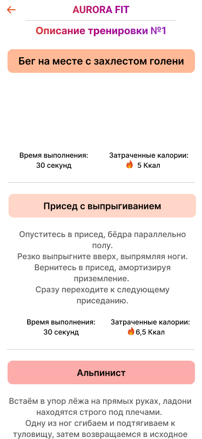
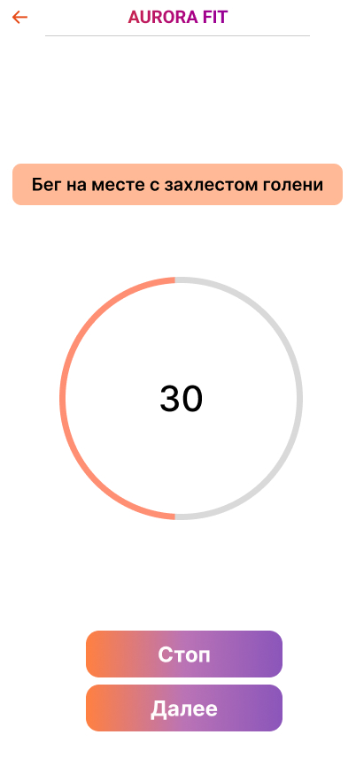

# Aurora Fit

## Лучшее приложение для фитнеса на самой классной операционной системе

**Aurora Fit** – это удобное и функциональное приложение, разработанное специально для пользователей операционной системы "Аврора". Оно поможет вам достичь ваших фитнес-целей, будь то улучшение общей физической формы, укрепление определённых групп мышц или релаксация через йогу и растяжку. Приложение позволяет удобно планировать, отслеживать и выполнять тренировки с учётом ваших предпочтений.

---

## Оглавление

1. [Запуск](#запуск)
2. [Начало работы](#начало-работы)
3. [Выбор тренировки](#выбор-тренировки)
4. [План тренировки](#план-тренировки)
5. [Выполнение упражнений](#выполнение-упражнений)
6. [Виды тренировок](#виды-тренировок)
7. [Галерея](#галерея)

---

## Запуск

Чтобы запустить приложение, найдите в меню устройство приложение **aurora_fit** с изображением эмблемы операционной системы «Аврора» и нажмите на него. После запуска вы попадете на главный экран, где отображаются:

- Название продукта с эмблемой операционной системы;
- Прогресс выполнения тренировок в виде пяти звёзд, заполняющихся по мере выполнения;
- Кнопки: `Продолжить` и `Увеличить прогресс`.

> [!CAUTION]
> #### Приложение работает только на Аврора ОС

---

## Начало работы

После нажатия кнопки `Продолжить` происходит переход на экран выбора тренировок, где:

- Отображается расписание тренировок;
- Предоставляется опция "добавить" для каждого дня, чтобы выбрать новую тренировку.

При выборе дня открывается экран с меню, состоящим из:

- Списка "Типы тренировок" в виде кнопок с изображениями категорий.

После выбора категории открывается экран с меню, отображающим список тренировок, включая:

- Названия тренировок;
- Время выполнения;
- Количество сжигаемых калорий;
- Кнопки `подробнее` и `выбрать`.

---

## Выбор тренировки

Нажав кнопку `выбрать`, вы попадете в диалоговое окно для задания времени начала тренировки. После нажатия `Принять`, выбранное время и категория тренировки отобразятся в расписании.

---

## План тренировки

Для просмотра подробного плана тренировки нажмите кнопку `подробнее`. В новом окне вы увидите детальное описание упражнений. Дополнительно можно нажать `подробнее` для каждого упражнения из списка, чтобы получить ещё больше информации.

---

## Выполнение упражнений

Для начала выполнения нажмите `Начать тренировку`. В открывшемся окне будут отображены:

- Название упражнения;
- Секундомер;
- Кнопки `Стоп` и `Далее`.

- Кнопка `Стоп` останавливает секундомер.
- Кнопка `Далее` переносит к следующему упражнению. После завершения всех упражнений вы увидите экран с сообщением о завершении тренировки и кнопкой `Продолжить`, которая вернёт вас к расписанию тренировок.

---

## Виды тренировок

Приложение включает следующие виды тренировок:

- Кардио;
- Силовые;
- Укрепление ног;
- Укрепление пресса;
- Укрепление рук;
- Укрепление спины и осанки;
- Растяжка;
- Йога.

---

## Галерея

