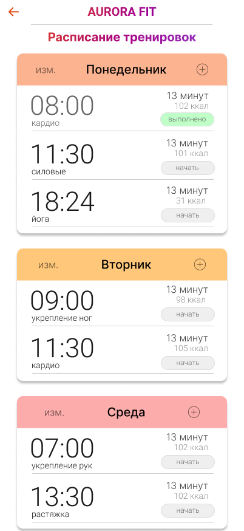
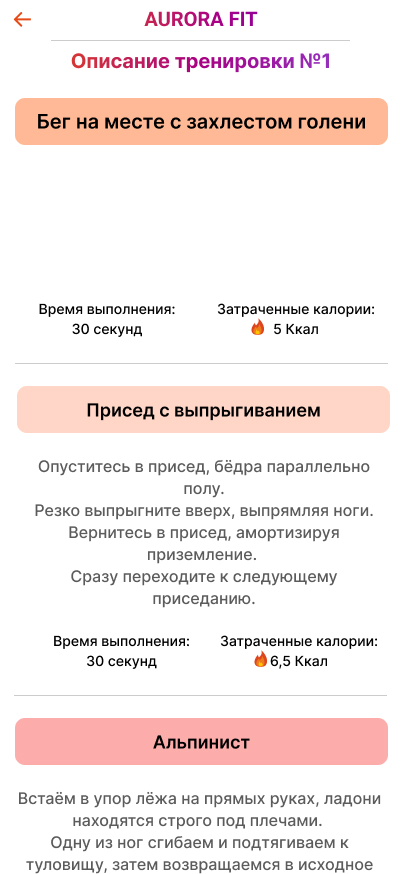
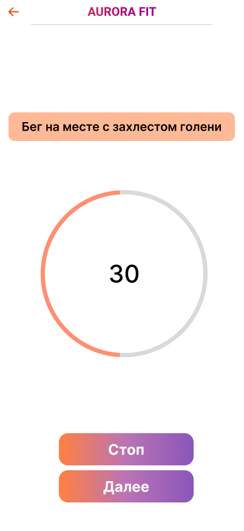

# Aurora Fit
### Developed at Sarov Institute of Physics and Technology, branch of NRNU MEPhI (SarPhTI MEPhI)
---
## The Best Fitness App for Aurora OS

**Aurora Fit** is a convenient and functional application designed specifically for users of the "Aurora" operating system.  
It helps you achieve your fitness goals — whether improving general physical shape, strengthening specific muscle groups, or relaxing through yoga and stretching.  
The app allows you to easily plan, track, and perform workouts based on your personal preferences.

---

## Project Goals

- Develop a modern, user-friendly, and secure fitness application for the **Aurora mobile platform**.  
- Increase users’ physical activity through convenient planning and visualization of workout processes.  
- Demonstrate the capabilities of cross-platform development using **Flutter for Aurora SDK**.  
- Ensure full offline functionality without relying on external servers or internet access.  

---

## Problems Solved

- Lack of high-quality, localized fitness apps compatible with Aurora OS.  
- Absence of simple tools for managing personal workout plans and tracking progress.  
- Need for offline functionality with local data storage on the device.  
- Lack of an intuitive and convenient interface optimized for Russian mobile devices.  

---

## Table of Contents
1. [Launch](#launch)
2. [Getting Started](#getting-started)
3. [Workout Selection](#workout-selection)
4. [Workout Plan](#workout-plan)
5. [Exercise Execution](#exercise-execution)
6. [Workout Types](#workout-types)
7. [Gallery](#gallery)
8. [Technical Implementation](#technical-implementation)
9. [Project Structure](#project-structure)
10. [Data Storage](#data-storage)
11. [Compatibility and Requirements](#compatibility-and-requirements)
12. [Authors](#authors)
13. [License](#license)

---

## Launch

To build the app, use:  
`flutter-aurora build aurora --release`  
Make sure to install [Flutter SDK for Aurora OS](https://gitlab.com/omprussia/flutter/flutter) beforehand.

> [!TIP]
> #### The app works only on Aurora OS.

---

## Getting Started

After pressing the `Continue` button, you will be taken to the workout selection screen, where:

- The workout schedule is displayed;  
- There is an "Add" option for each day to create a new workout.

When you select a day, a screen opens with a menu that includes:

- A list of "Workout Types" as buttons with category images.

After choosing a category, another menu appears with a list of workouts that includes:

- Workout names;  
- Duration;  
- Calories burned;  
- Buttons `Details` and `Select`.

---

## Workout Selection

When you press the `Select` button, a dialog appears where you can set the workout start time.  
After pressing `Confirm`, the selected time and category appear in the schedule.

---

## Workout Plan

To view a detailed workout plan, press the `Details` button.  
A new window will open showing a full description of exercises.  
You can also press `Details` for each exercise in the list to see additional information.

---

## Exercise Execution

To start the workout, press `Start Workout`.  
The following elements will be displayed:

- Exercise name;  
- Stopwatch;  
- Buttons `Stop` and `Next`.

- The `Stop` button pauses the timer.  
- The `Next` button switches to the next exercise.  
After completing all exercises, you will see a completion screen with a `Continue` button returning you to the workout schedule.

---

## Workout Types

The app includes the following types of workouts:

- Cardio  
- Strength  
- Leg training  
- Core/Abs strengthening  
- Arm workouts  
- Back and posture correction  
- Stretching  
- Yoga  

---

## Gallery

---

## Technical Implementation

Aurora Fit is developed using **Flutter** (compatible with Aurora OS) and follows the **MVVM** architecture pattern.  
The app is optimized for mobile devices and efficiently utilizes system resources:  
- No non-functional or crash-prone UI elements;  
- Smooth animations and responsive user interface;  
- Works completely offline without requiring an internet connection;  
- Automatically saves and restores user data upon relaunch.  

All potential errors have been eliminated through testing on both the Aurora emulator and real devices.

---

## Project Structure

The project consists of the following main modules:

| Module | Description |
|--------|-------------|
| **lib/classes/** | Contains helper classes and custom UI components (buttons, visual elements, data storage services). |
| **lib/json/** | Stores static JSON data and predefined workout sets. |
| **lib/models/** | Defines data models: exercises, categories, workouts, and workout types. |
| **lib/pages/** | Contains application screens: schedule, workout selection, exercise execution, and results view. |
| **lib/services/** | Implements business logic: data management, notifications, and workout loading. |
| **lib/main.dart** | Main entry point of the application, initializes structure and interface. |

**Project Objective** – Create a user-friendly offline fitness app compatible with the domestic Aurora mobile platform, focusing on local data processing and personal motivation.  

**Addressed Problem** – Lack of high-quality offline fitness solutions for Aurora OS with a modern interface and workout planning system.

---

## Data Storage

All user data (workout plans, schedules, selected exercises) are saved **locally** when the app closes and are automatically restored upon reopening.  
The app uses the built-in `SharedPreferences` (or Aurora plugin equivalent) for secure and autonomous storage.

---

## Compatibility and Requirements

- The app is **compatible with Aurora OS version 5.0 and higher**.  
- Only plugins validated and available in **Aurora SDK** are used.  
- The app successfully runs on both emulator and physical devices.  
- The app content complies with regulations and contains no offensive materials.

---

## Authors

The list of project contributors is available in [AUTHORS.md](AUTHORS.md).  
It includes developers, designers, testers, and other participants involved in creating Aurora Fit.

---

## License

This project is distributed under the **BSD-3-Clause** license.  
The full text of the license is available in the [LICENSE](LICENSE) file.
